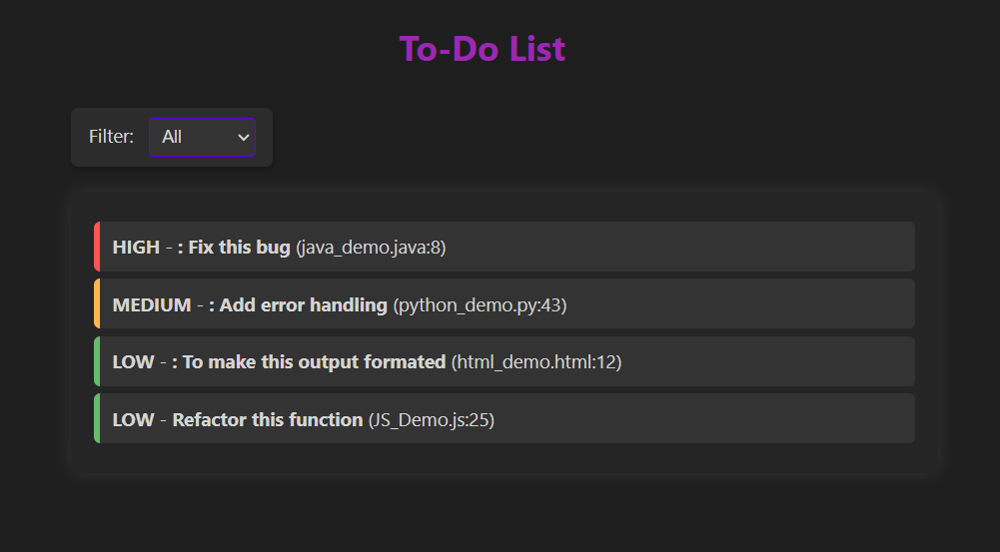

# Tasks ToDo - VS Code Extension

A simple yet powerful VS Code extension to track and manage TODO comments in your code. It scans your workspace, lists all TODOs in a webview, and allows easy filtering based on priority.

## Usage

**Open the Tasks ToDo panel:**

Press `Ctrl+Shift+P` (`Cmd+Shift+P` on macOS) and select "Show ToDos".

**Adding a TODO comment:**

Insert a TODO comment in your code using the following format:

JavaScript / TypeScript / Java / C++ / C# / Go

```// TODO [1] Fix this bug```

```/* TODO [3] Refactor this function */```

Python

```# TODO [2] Add error handling```

HTML / XML

```<!-- TODO [3] To make this output formated -->```

**Priorities:** You can categorize TODOs based on urgency:

**[1]** → High Priority

**[2]** → Medium Priority (Default if no priority is specified)

**[3]** → Low Priority

**Filtering TODOs:**

Use the filter dropdown in the WebView to display only high, medium, or low priority tasks.

## Features

- [x] Automatically scans TODOs across your project.
- [x] Supports multiple programming languages (.js, .ts, .py, .java, .cpp, .cs, .go, .html, .xml, .css).
- [x] Priority-based filtering ([1], [2], [3]).
- [x] Dark-themed UI.

## Screenshot



## Future Enhancements

**Navigating to TODOs:**

Click on a TODO item in the webview, and the file will open at the specific line.

**Removing TODOs:**

Click on a marks as done button to remove TODO comments directly from the file.

## Contributing

If you want to improve this extension:

Fork the repository

Create a new branch for your feature or fix

Submit a pull request with your changes

## License

This project is licensed under the MIT License.

## Enjoying the extension?

If you find this useful, feel free to star ⭐ the repository and contribute!
